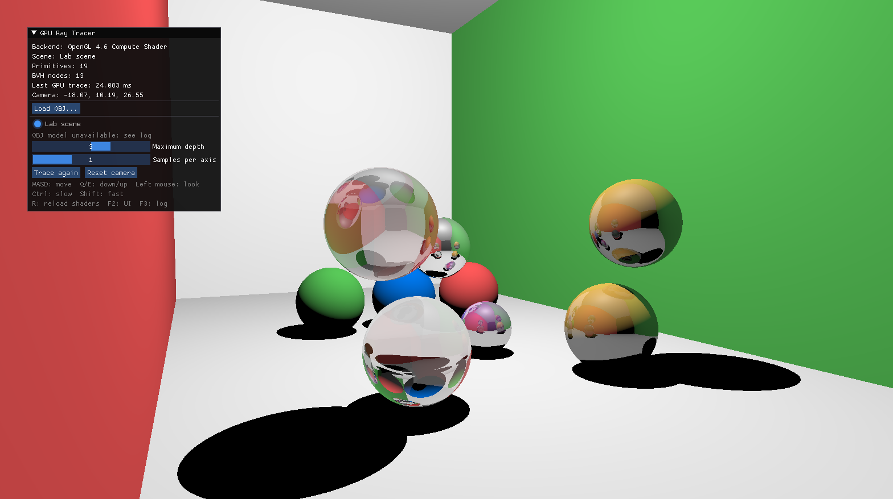

# GPU Ray Tracing

## Project Goal

This project implements an interactive Whitted-style ray tracer with an OpenGL compute shader. The CPU loads the scene and builds an AABB BVH, while the GPU traverses the BVH and evaluates hard shadows, reflection, refraction, and anti-aliasing.

The renderer supports both a built-in scene and external OBJ models. While the camera is moving, it temporarily uses a lower-quality preview and restores the selected quality when movement stops.

## Code

- [Application, scene loading, and BVH construction](../../src/EDAN35/assignment1.cpp)
- [Ray-tracing compute shader](../../shaders/EDAN35/assignment1_raytrace.comp)
- [Full-screen vertex shader](../../shaders/EDAN35/assignment1_present.vert)
- [Full-screen fragment shader](../../shaders/EDAN35/assignment1_present.frag)
- [Additional usage notes](../../src/EDAN35/ASSIGNMENT1.md)

The project uses CG_Labs/Bonobo for window creation, input, camera control, ImGui, Assimp integration, and shader management.

## Build

This project is built as part of CG_Labs. Follow the repository setup and Visual Studio instructions in:

- [CG_Labs README](../../README.rst)
- [CG_Labs build guide](../../BUILD.rst)

## Usage

1. Open the CG_Labs repository folder in Visual Studio and wait for **CMake generation finished.**
2. In the target dropdown next to the green Run button, select `src\EDAN35\EDAN35_Assignment1.exe`. Do not select an `(Install)` target.
3. Press `F5` to build and run the project.

Use the ImGui interface to load an OBJ model, switch scenes, change the maximum ray depth, select the samples per pixel, or retrace the current view.

| Input | Action |
| --- | --- |
| `W/A/S/D` and `Q/E` | Move the camera |
| Drag with the left mouse button | Rotate the camera |
| `R` | Reload shaders |
| `F2` | Show or hide the interface |
| `F3` | Show or hide the log |
