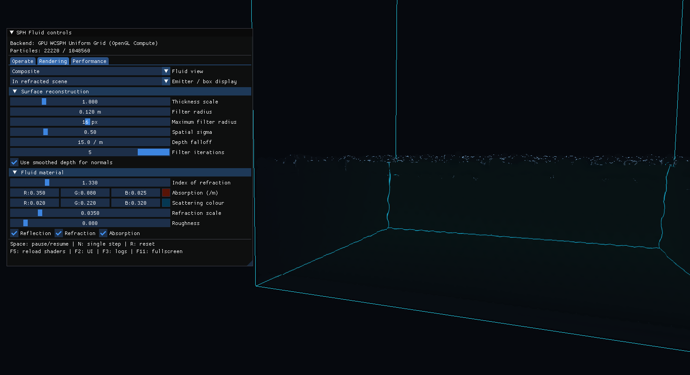

# Real-Time SPH Fluid Simulation

## Project Goal

This project implements an interactive WCSPH fluid simulation in C++17 and OpenGL. It includes CPU and GPU solvers, uniform-grid neighbour search, multithreaded CPU simulation, and screen-space fluid rendering.

## Code

- [Project source](../../src/SPHFluid)
- [Simulation code](../../src/SPHFluid/simulation)
- [Rendering code](../../src/SPHFluid/rendering)
- [Compute shaders](../../shaders/SPHFluid)
- [Tests and benchmark results](../../results/SPHFluid)

The project uses CG_Labs for window creation, input, camera control, ImGui, shader management, and CMake dependencies.

## Build

This project is built as part of CG_Labs. Follow the repository setup and Visual Studio instructions in:

- [CG_Labs README](../../README.rst)
- [CG_Labs build guide](../../BUILD.rst)

## Usage

1. Open the CG_Labs repository folder in Visual Studio and wait for **CMake generation finished.**
2. In the target dropdown next to the green Run button, select `src\SPHFluid\SPH_Fluid.exe`. Do not select an `(Install)` target.
3. Press `F5` to build and run the project.

The ImGui interface can be used to control the particle emitter, collision box, SPH parameters, rendering mode, and performance display.

| Input | Action |
| --- | --- |
| `Space` | Pause or resume the simulation |
| `N` | Advance one simulation step |
| `R` | Reset the simulation |
| `F2` | Show or hide the controls |
| `F5` | Reload shaders |
